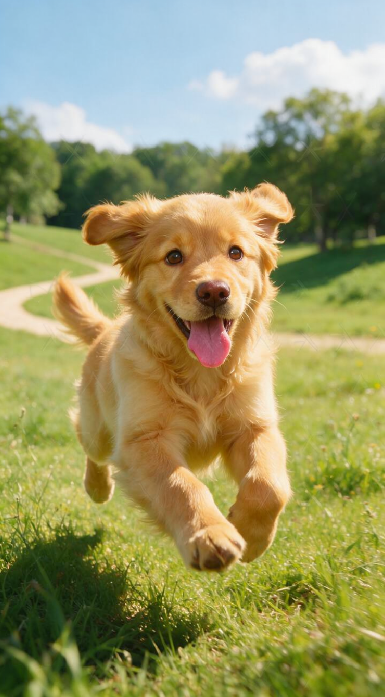

# comfyui-dit-watermark

为 ComfyUI 图像工作流快速写入和检测不可见水印。检测无需 diffusion inversion，也无需重新运行生成模型：直接对图片做一次 VAE encode 即可读取水印，速度快，适合批量验图和自动化流程。项目提供 GROW 渐进式频域水印节点，支持弹性 Reed–Solomon 纠错、旋转/裁剪 robust search 和 RGB PSNR 质量测量。

| 原图 | Identity clean | 写入水印后 |
|---|---|---|
|  |  |  |

算法基于 [luopengchen/GROW](https://github.com/luopengchen/GROW)，并针对 ComfyUI 通用 `SAMPLER` 接口、Flux2 Klein 4B Distilled 四维 latent、Qwen Image Edit 单帧五维 latent 和 inference mode 做了适配。

## 三图效果验证

测试使用 Flux2 UI 工作流 `workflows/flux2_klein_image_edit_grow.json` 的模型、seed、采样器、频带和提示词：

```text
Keep the input image exactly unchanged. Preserve every pixel, color, texture, composition, and detail.
```

公开输入字段名是 `watermark`，本次三张图实际写入的内容统一为 `zhangp36512345`，`secret_key=watermark`。

| 图片 | Clean → marked PSNR | ECC 检测 |
|---|---:|---|
| Dog | **41.212684 dB** | 成功，0 symbol 修正 |
| Claw | **40.970031 dB** | 成功，0 symbol 修正 |
| Girl | **38.193383 dB** | 成功，0 symbol 修正 |

三张图均完整恢复 `zhangp36512345`，且水印增量 PSNR 均高于新的 35 dB 门槛。当前唯一工作流统一使用：

| `strength` | `guidance_scale` | `start_ratio` | 引导步数 |
|---:|---:|---:|---:|
| 1.20 | 4000 | 0.00 | 4/4 |

PSNR 以相同输入、prompt、seed、模型和采样参数的 clean 输出为 reference，只衡量 GROW 引入的变化。源图片还会经过 Flux2/VAE 重建，源图到输出的变化不能算作水印失真。

## 节点

### GROW DiT Sampler

```text
KSamplerSelect → GROW DiT Sampler → SamplerCustomAdvanced
```

节点在选定的去噪步骤拦截 DiT 预测的干净 latent `x0`，对 secret-key 控制的中频坐标计算 fp32 FFT/DCT-proxy sign-margin loss，再将引导后的 `x0` 交还原 sampler。默认 `start_ratio=0`，Flux2 四步采样从第一步开始、共引导 4/4 steps。模型、conditioning、scheduler、noise 和 VAE 权重均不修改。

| 输入 | 作用 | Flux2 默认值 |
|---|---|---:|
| `watermark` | UTF-8 水印内容，最多 250 bytes | `zhangp36512345` |
| `secret_key` | 决定频率坐标顺序 | `watermark` |
| `strength` | 最小有符号频率间隔 | `1.20` |
| `guidance_scale` | 水印梯度步长 | `4000` |
| `start_ratio` | 开始引导的采样比例 | `0.00` |
| `dct_min`, `dct_max` | 归一化中频范围 | `0.15`, `0.45` |
| `max_channels` | 使用的 latent 通道数 | `8` |
| `channel_start` | 连续通道 profile 的起始 latent channel | `4` |
| `center_ratio` | 使用的中心 latent 比例 | `1.0` |

`strength` 在 UI 中按 0.01 步进显示，`guidance_scale` 按整数步进显示。超过 32 UTF-8 bytes 会发出长水印警告：帧越长，每个 bit 的频率重复次数越少，攻击鲁棒性越低，盲检候选长度也越多。

### GROW Watermark Detect

输入生成结果 `IMAGE` 和同一个 `VAE`。检测节点无需预先提供水印内容；弹性帧包含长度和 Reed–Solomon 校验信息，但必须使用相同 secret key、频带、起始通道、通道数和中心比例。`max_watermark_bytes` 控制盲检长度上限，`robust_mode` 可选择 `none`、`rotation`、`crop_scale` 或组合搜索。

#### 嵌入与检测参数必须一致

`secret_key`、`dct_min`、`dct_max`、`max_channels`、`channel_start`、`center_ratio` 共同定义 bit 到 latent 频率坐标的布局。检测端任一项不一致，就会读取不同系数或用不同方式拆分 bit，通常无法通过 RS 校验。水印内容无需传给 detector，但布局参数不是可从当前帧中任意盲推的。

当前工作流应把 sampler 与 detector 的这些值保持一致。更稳妥的后续节点设计是增加一个 `GROW Watermark Config` 节点，输出单个 `GROW_CONFIG` 对象，同时连接 sampler 和 detector，消除两份 UI 参数漂移。检测外部攻击图片时，可对少量预定义 profile（例如 0–4）做有界搜索并以 RS 有效性和 vote margin 选优；不建议对连续的 `dct_min/dct_max` 任意暴力搜索，因为组合数、VAE 次数和误判面都会快速增加。若要让图片完全自描述，需要在固定、不随 profile 改变的 pilot 频带写入布局 ID/header，再据此读取主 payload。

Claw/profile 1 的单参数错配实测也验证了这一点：完全匹配时原始码字零错误；分别只把 `channel_start` 改为 0、`max_channels` 改为 4、`dct_min` 改为 0.10 或 `dct_max` 改为 0.50，四种情况均 `ecc_valid=False`。注意错配 `max_channels` 时 vote margin 仍可达到 1.0，因此 margin 高不代表布局正确，必须以 RS/帧校验为准。

输出包括 `decoded_message`、`ecc_valid`、`corrected_symbols`、`min_vote_margin` 和 `raw_codeword_hex`。检测流程为：

```text
IMAGE → VAE encode → keyed latent frequency signs → majority vote → RS decode
```

它不加载额外扩散模型，也不执行 diffusion inversion。

### GROW Image PSNR

输入相同尺寸的 reference 和 watermarked `IMAGE`，输出 `[0,1]` RGB PSNR。

## Reed–Solomon 纠错

每个水印编码成最短的自描述弹性帧：

```text
1-byte UTF-8 length + N-byte payload + 4 RS parity bytes
```

总长度为 `N+5` bytes；本次 14-byte 水印从旧协议的 32 bytes 缩短到 19 bytes，因而每 bit 获得更多频率重复。四个 parity symbols 可纠正任意两个损坏的 byte symbols。超过纠错能力或帧结构异常时返回 `ecc_valid=False`。ASCII 的两个字符对应两个 symbols；中文字符是多字节 UTF-8，因此能力按损坏 bytes 计算。默认检测上限 64 bytes，并兼容旧 32-byte 零填充帧。

## 防攻击性能

- **Flux2 Klein（Dog、Claw、Girl）**：48 个压缩、旋转和裁剪攻击样本中完整恢复 43 个，成功率 **89.58%**；AVIF、HEIF、JXL、crop 和 JPEG q50 以上均全部恢复。
- **Qwen Image Edit 2511（Claw 初测）**：16 个攻击样本中完整恢复 12 个，成功率 **75.00%**；当前结果仅代表单图初测，不与 Flux2 三图结果合并。

完整测试条件、逐项结果、resize 对照、失败边界与历史数据见 [防攻击性能测试](docs/attack_resistance_benchmarks.md)。

## 安装

将仓库放入：

```text
ComfyUI/custom_nodes/comfyui-dit-watermark
```

然后重启 ComfyUI。运行时只依赖 ComfyUI 自带的 PyTorch，不需要额外 ECC 包。本次远程部署路径为 `/app/custom_nodes/comfyui-dit-watermark`。

## 工作流

仓库提供两份可直接载入 ComfyUI 的 UI 工作流：

```text
workflows/flux2_klein_image_edit_grow.json
workflows/image_qwen_image_edit_2511.json
```

- **Flux2 Klein**：`flux2_klein_image_edit_grow.json`，面向 Flux2 Klein 4B Distilled 四步采样。
- **Qwen Image Edit 2511**：`image_qwen_image_edit_2511.json`，使用 fp8 模型且不加载 LoRA，并通过高级采样组件为原标准 KSampler 增加可接入的 `SAMPLER` 输入。

两份工作流都包含 identity prompt、`GROW DiT Sampler`、无需预知水印内容的检测节点，以及 `watermark=zhangp36512345`。

## 兼容性与限制

- 已在 ComfyUI 0.26.0、Flux2 Klein 4B Distilled、Euler 四步采样上验证。
- 返回四维 `[B,C,H,W]` 或单帧五维 `[B,C,1,H,W]` latent 的图像 DiT 可复用 sampler wrapper；多帧视频 latent 当前不支持。
- 检测节点已支持旋转与裁剪/尺度 robust search；裁剪实测稳定，旋转仍有明显残余错误。
- 抗压缩能力与图像内容相关，应为实际图片保留纠错余量。
- secret key 会以明文保存在工作流 JSON 中，不应把生产密钥放入公开工作流。

## 测试

```powershell
python -m unittest discover -s tests -v
```

测试覆盖 GROW guidance、inference mode、弹性帧、旧帧兼容、双 symbol 纠错、三 symbol 拒绝、盲长度检测、几何候选、公开 `watermark` 接口、工作流配置和攻击汇总。

## 致谢

感谢 [luopengchen/GROW](https://github.com/luopengchen/GROW) 开源渐进式频域水印算法与实现，为本项目的 ComfyUI 节点适配提供了基础。
